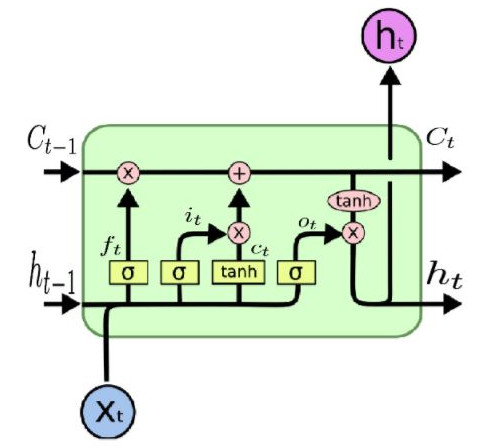
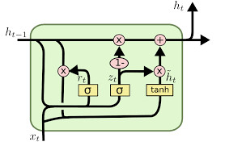

# Making a chatbot using the Seq2Seq model

This is a simple implementation of the [**sequence to sequence model**](https://arxiv.org/abs/1409.3215) to make a chatbot (based on the paper [**"A Neural conversational model"**](https://arxiv.org/abs/1506.05869) by Oriol Vinyals and Quoc Le ).

We used tensorflow to implement the model, and based the implementation in the following references :

*   [**DeepQA**](https://github.com/Conchylicultor/DeepQA) repo by Etienne Pot
*   [**Stanford-tensorflow-tutorials**](https://github.com/chiphuyen/stanford-tensorflow-tutorials/tree/master/2017/assignments/chatbot) repo by Chip Huyen

There are 3 main sections :

*   [About the model](#section1)
*   [Implementation](#section2)
*   [Results and thoughts](#section3)

## <a name="section1"></a> About the model


The sequence to sequence model consists of two RNN structures: a Encoder and a Decoder.

Basically, the encoder ( implemented using a sequence to vector RNN ) is in charge of compressing the information of the sequence given into a vector that summarizes all this information. Then this vector is used by the decoder ( implemented using a vector to sequence RNN ) to generate an output sequence.

The use of RNNs for these kind of tasks is described in various sources, an basically we use them because we have to deal with an input that is a sequence of non-defined length. If we used a basic Feed forward net, we should have to specify a fixed size for the input ( maybe a huge vector that would be a concatenation of the sequence, with some kind of padding, which would be very sparse ).

Next, we will analyze each component of the model :

## Encoder

* Word embeddings :

The inputs to our RNN are a sequence of vectors, which in our case should represent each word of a given sequence of words. This is achieved by using the word-embedding of a certain word, which is a fixed size vector that represents the word in a high dimensional space.


Because the one-hot vectors are used to lookup the word-embedding from the embeddings matrix, we can basically replace the matrix-vector multiplications by a row look-up. So, the inputs to our models are integers that will look-up the embeddings.

* Vocabulary :

As described earlier, the inputs are just look-up unique indices which will look up an embedding related to a word. We have then to basically make a big dictionary of word-LookupIndex mappings that will serve the purpose of transforming a sequence into an array of indices to feed to our encoder. A portion of this mapping is show below.

    * fawn - 38069
    * woods - 2168
    * clotted - 27995
    * \padding\ - 0
    * \unknown\ - 1
    * \start\ - 2
    * \stop\ - 3
    * hanging - 1345
    * woody - 5332
    * tingly - 47470
    * localized - 27996
    * spidery - 27997
    * sevens - 24130
    * disobeying - 24131
    * mutinied - 38070
    * mathison - 31647

Here, each word is given an id, and as you can see there are some  symbols that are given special ids: \padding\, \unknown\, \start\, \stop\, being used to pad a sequence ( complete up to size ), replace in case not found in dictionary, start a sequence for decoder and stop a sequence for the decoder, respectively.

* Input sequence length :

We could keep feeding the encoder data, and it would happily keep encoding this data into the final vector, but the implementation we based on uses a fixed-size sequence length. This serves like the number of iterations in time that our RNN will compute. It also kind of helps when dealing with long sequences, as if some information could be split into two parts that have differente context, then the relationship between these wouldn't be mixed into one vector, but two.

Of course, there are implementations that use dynamic sequence length, as described [**here**](https://danijar.com/variable-sequence-lengths-in-tensorflow/) and [**here**](https://r2rt.com/recurrent-neural-networks-in-tensorflow-iii-variable-length-sequences.html), or tensorflow's [**dynamic_rnn**](https://www.tensorflow.org/versions/master/api_docs/python/tf/nn/dynamic_rnn)

* Padding :

Some sequences may be shorter than the input-sequence, so we use padding to make this fit into the encoder's input size. Basically, if the sentence "hey bro, how are you?" is split into "[ 'hey', 'bro', ',', 'how', 'are', 'you', '?' ]", and then converted into "[ 10, 25, 75, 454, 123, 657, 1087 ]" we can pad it to a size of 10 by adding the remaining slots as '0' ( or the padding index of the padding symbol in our vocabulary ), which will become "[ 10, 25, 75, 454, 123, 657, 1087, 0, 0, 0 ]"


## RNN cells :

There are some options as to what kind of cell to use in our RNN, which could be a vanilla RNN cell, an LSTM cell and a GRU cell.

Recall, a RNN can be seen in an unrolled way, as shown in the following picture :


Each of those rectangles with an 'A' represent an RNN cell ( here, just to be clear, when they mean single cell, they mean this is a full layer of this computing cells  )

The vanilla RNNs have as single computing unit the following RNN cell :


An its computation is given by the following :

)

The cells we used are LSTMs and GRUs, both part of the tensorflow API. Both these cells have the advantage of filtering some of the input from previous states so that we avoid the vanishing gradient problem because of constant multiplications. Instead, they update with sums, which generates a nicer gradient.

For more info about these cells, you could check [**this**](http://www.wildml.com/2015/10/recurrent-neural-network-tutorial-part-4-implementing-a-grulstm-rnn-with-python-and-theano/) and [**this**](https://theneuralperspective.com/2016/11/17/recurrent-neural-network-rnn-part-4-custom-cells/)

An LSTM cell looks like this :



And a GRU cell looks like this :



GRU cells are quite similar in performance to LSTM cells, but their upside is that they perform less computation that LSTMs.

## Decoder

Once the thought vector is generated in the last iteration of the encoder we can use it in the decoder to generate the output sequence. The thought vector is fed as the first hidden state of the decoder cell and a start token is fed as first input to the same cell. 

The model is a bit different depending in the mode chosen : training or testing, which we will describe below.

* Training Mode

In this mode, the **subsequent inputs** ( after the start token ) to the decoder cell are the **target outputs** that we want to predict. For example, if the answer to the encoder sequence 'hey man' was 'hello bro', then the 'hello' target is fed as the input in the second step of the decoder.


* Testing mode

In this mode, we basically need the model to generate the whole sequence on its own, so the inputs used for the decoder in subsequent iterations are the previous predicted outputs of the decoder. So, for example, if the input to the encoder was 'hey man', and our first predicted output word was 'hi', then this 'hi' is fed into the next input to the decoder.


## <a name="section2"></a> Implementation Details

We used tensorflow and its API to construct our model. This can be found in the [modelSeq2Seq.py](ml/modelSeq2Seq.py) file, the data utility can be found in [dataUtils.py](ml/dataUtils.py), the chatbot entrypoint in the [chatbot.py](chatbot.py) file, and the configuration parameters can be found in the [config.py](ml/config.py) file.

### Model implementation

We first create some placeholders according to the encoder-decoder sequence sizes.

```python
        with tf.name_scope( 'model_encoder' ) :
            # encoder inputs accept the one-hot encoding of the word
            self.m_encoderInputs = [ tf.placeholder( tf.int32, [ None, ], name = "model_encoder_inputs" ) 
                                    for _ in range( ModelConfig.INPUT_SEQUENCE_LENGTH )  ]

        with tf.name_scope( 'mode_decoder' ) :
            self.m_decoderInputs  = [ tf.placeholder( tf.int32,   [ None, ], name = 'model_decoder_inputs' ) for _ in range( ModelConfig.OUTPUT_SEQUENCE_LENGTH ) ]
            self.m_decoderTargets = [ tf.placeholder( tf.int32,   [ None, ], name = 'model_decoder_targets' ) for _ in range( ModelConfig.OUTPUT_SEQUENCE_LENGTH ) ]
            self.m_decoderWeights = [ tf.placeholder( tf.float32, [ None, ], name = 'model_decoder_weights' ) for _ in range( ModelConfig.OUTPUT_SEQUENCE_LENGTH ) ]
```

As the names describe, the are creating the inputs to both encoder and decoder, the target outputs of the decoder ( used in training mode ) and the masks of the decoder inputs. This is used to deal when padding tokens are fed as inputs, as we make them 0 when padding tokens are used.

We then create the cells itself.

```python
        for _ in range( ModelConfig.NUM_LAYERS ) :

            _encDecCell = tf.contrib.rnn.BasicRNNCell( ModelConfig.NUM_HIDDEN_UNITS )

            if ModelConfig.CELL_TYPE == 'LSTM' :
                _encDecCell = tf.contrib.rnn.BasicLSTMCell( ModelConfig.NUM_HIDDEN_UNITS )
            elif ModelConfig.CELL_TYPE == 'GRU' :
                _encDecCell = tf.contrib.rnn.GRUCell( ModelConfig.NUM_HIDDEN_UNITS )

            # if in training, add dropout
            # see for reference : http://jmlr.org/papers/volume15/srivastava14a/srivastava14a.pdf
            if not ModelConfig.IS_TEST :
                _encDecCell = tf.contrib.rnn.DropoutWrapper( _encDecCell,
                                                             input_keep_prob = 1.0,
                                                             output_keep_prob = ModelConfig.DROPOUT )

            _cells.append( _encDecCell )

        # see https://r2rt.com/recurrent-neural-networks-in-tensorflow-ii.html
        # algo, check MultiRNNCell in rnn_cell_impl.py in the tensorflow code ( call nethod at line 1202 )
        self.m_encDecCells = tf.contrib.rnn.MultiRNNCell( _cells )
```

With the default configuration, we create a 2-layer RNN with 512 hidden units for each cell, which uses LSTM cells.

We then create the seq2seq model itself, using the tensorflow API :

```python
        if ModelConfig.USE_ATTENTION :
            self.m_decoderOutputs, self.m_states = tf.contrib.legacy_seq2seq.embedding_attention_seq2seq(
                                                        self.m_encoderInputs,
                                                        self.m_decoderInputs,
                                                        self.m_encDecCells,
                                                        self.m_textData.getVocabularySize(),
                                                        self.m_textData.getVocabularySize(),
                                                        embedding_size = ModelConfig.EMBEDDINGS_SIZE,
                                                        output_projection = _outputProjection.getWeights() if _outputProjection else None,
                                                        feed_previous = ModelConfig.IS_TEST )
        else :
            self.m_decoderOutputs, self.m_states = tf.contrib.legacy_seq2seq.embedding_rnn_seq2seq(
                                                        self.m_encoderInputs,
                                                        self.m_decoderInputs,
                                                        self.m_encDecCells,
                                                        self.m_textData.getVocabularySize(),
                                                        self.m_textData.getVocabularySize(),
                                                        embedding_size = ModelConfig.EMBEDDINGS_SIZE,
                                                        output_projection = _outputProjection.getWeights() if _outputProjection else None,
                                                        feed_previous = ModelConfig.IS_TEST )
```

This creates the actual seq2seq architecture, with the following :

* We pass the encoder inputs and outputs placeholders, as well as the cell previously defined.
* We pass the vocabulary size for both encoder and decoder. As you can see, in our case these are the same size. This is used as the dimensions for the embedings matrices craeted for the encoder and decoder lookup steps.
* We also pass the embeddings size to complete the definition of the embeddings matrices.
* We then pass the weights of the output projection step, in case we are using sampled softmax. If not using this, we just pass None.
* Finally, we pass a boolean to set whether or not we are in test mode. If so, we then feed the previos output prediction to the next input in the encoder, as described earlier. If not, we are just passing the targets as inputs.

If using the attention mechanism, we create the model using tf's **embedding_attention_seq2seq**. If not, we create the model with **embedding_rnn_seq2seq**. 

As the name suggests, the model is created with embeddings in mind. It creates an embedding look-up layer in between both encoder inputs and decoder inputs. You can check this in tensorflows's source code :

```python
### tf's insides of embedding_rnn_seq2seq

## encoder creation snippet
    
    # ...

    # Encoder.
    encoder_cell = copy.deepcopy(cell)
    encoder_cell = core_rnn_cell.EmbeddingWrapper(
        encoder_cell,
        embedding_classes=num_encoder_symbols,
        embedding_size=embedding_size)
    _, encoder_state = rnn.static_rnn(encoder_cell, encoder_inputs, dtype=dtype)

    # ...

## decoder creation snippet

    # ...

    # Decoder.
    if output_projection is None:
      cell = core_rnn_cell.OutputProjectionWrapper(cell, num_decoder_symbols)

    if isinstance(feed_previous, bool):
      return embedding_rnn_decoder(
          decoder_inputs,
          encoder_state,
          cell,
          num_decoder_symbols,
          embedding_size,
          output_projection=output_projection,
          feed_previous=feed_previous)

    # If feed_previous is a Tensor, we construct 2 graphs and use cond.
    def decoder(feed_previous_bool):
      reuse = None if feed_previous_bool else True
      with variable_scope.variable_scope(
          variable_scope.get_variable_scope(), reuse=reuse):
        outputs, state = embedding_rnn_decoder(
            decoder_inputs,
            encoder_state,
            cell,
            num_decoder_symbols,
            embedding_size,
            output_projection=output_projection,
            feed_previous=feed_previous_bool,
            update_embedding_for_previous=False)
        state_list = [state]
        if nest.is_sequence(state):
          state_list = nest.flatten(state)
        return outputs + state_list

    # ...

```

As you can, there are some calls to some functions that will add the embeddings part into the computation graph.

Also, it can be noticed that there is quite some code that wrapps some functionality when building the computation graph. Keep in mind that to use tensorflow you have to make a computation graph, so most of the time you would just see wrappers around wrappers that build this computation. Only in the last unwrapper-parts of the code you could see the actual computations made ( activations, multiplications, concats, etc. ). If in doubt about the implementation, just follow along some of the tf's source code. This will help you to see the actual computations made and check that with the theory.

We then create the final parts of the model, namely the actual outputs and the loss function.

```python
        if ModelConfig.IS_TEST :
            if not _outputProjection :
                self.m_outputs = self.m_decoderOutputs
            else :
                self.m_outputs = [ _outputProjection( _decOutput ) for _decOutput in self.m_decoderOutputs ]

        else :

            self.m_lossFcn = tf.contrib.legacy_seq2seq.sequence_loss(
                                    self.m_decoderOutputs,
                                    self.m_decoderTargets,
                                    self.m_decoderWeights,
                                    self.m_textData.getVocabularySize(),
                                    softmax_loss_function = sampledSoftmax if _outputProjection else None )
            tf.summary.scalar( 'loss', self.m_lossFcn )

            _opt = tf.train.AdamOptimizer(
                                learning_rate = ModelConfig.LEARNING_RATE,
                                beta1 = 0.9,
                                beta2 = 0.999,
                                epsilon = 1e-08 )

            self.m_optimizer = _opt.minimize( self.m_lossFcn )
```

Here, we check if whether we are in test mode or not. If so, we create only the outputs using the output-projection trick ( if used ). This is used if the loss function we use is [**sampled softmax**](https://www.tensorflow.org/versions/r1.0/tutorials/seq2seq#sampled_softmax_and_output_projection). You can check [**this**](https://stackoverflow.com/questions/39573188/output-projection-in-seq2seq-model-tensorflow) for some more insight.

Finally, the last part of the model class deals with running the model given a batch of data.

```python

    def step( self, batch ) :

        # batch input is an object containing :
        #     * testmode  : just input data ( input-> encoder seq, decoder seq, target seq, weights )
        #     * trainmode : input and target output
        # returns the operators to run the session

        _feedDict = {}
        _ops = None

        if not ModelConfig.IS_TEST : # training mode

            for i in range( ModelConfig.INPUT_SEQUENCE_LENGTH ) :
                _feedDict[ self.m_encoderInputs[ i ] ] = batch['encoderSeqs'][ i ]

            for i in range( ModelConfig.OUTPUT_SEQUENCE_LENGTH ) :
                _feedDict[ self.m_decoderInputs[ i ] ] = batch['decoderSeqs'][ i ]
                _feedDict[ self.m_decoderTargets[ i ] ] = batch['targetSeqs'][ i ]
                _feedDict[ self.m_decoderWeights[ i ] ] = batch['weights'][ i ]

            ops = ( self.m_optimizer, self.m_lossFcn )

        else :

            for i in range( ModelConfig.INPUT_SEQUENCE_LENGTH ) :
                _feedDict[ self.m_encoderInputs[ i ] ] = batch['encoderSeqs'][ i ]

            _feedDict[ self.m_decoderInputs[0] ] = [ self.m_textData.m_vocab[ DataConfig.TOKEN_START ] ]

            ops = ( self.m_outputs, )

        return ops, _feedDict

```

Here, we create the parameters to run the session on, and the dictionary of parameters to feed to the session. If in training mode, we feed encoderInputs ( input sequence ), decoderInputs ( targets words shifted one to the right, and with the start token in the start of the sequence ), decoderTargets ( words we want to predict ) and decoderWeights ( masks to use if deadling with padded tokens ).

### Data handling

The dataset used was the [**Cornell movie-dialogs dataet**](https://www.cs.cornell.edu/~cristian/Cornell_Movie-Dialogs_Corpus.html), which was parsed into an appropiate structure using the [dataUtils.py](ml/dataUtils.py) file.

```python
    def _parseCornellDataset( self ) :

        if not DataConfig.USE_PREPROCESSED :

            _id2line = self._pcGetLines()
            _convSequences = self._pcGetConvSequences()
            self.m_encLines, self.m_decLines = self._pcGetQAs( _id2line, _convSequences )

            self._buildVocabulary( self.m_encLines, self.m_decLines )
            self.m_encSeqs, self.m_decSeqs = self._lines2ids( self.m_encLines, self.m_decLines )

            self._saveDataset()

        else :

        # load the pre-processed dataset
```

We first parse the data into 2 structures: **\_id2line** and **\_convSequences**. The first is a dictionary that contains all the lines in the conversations corpus mapped to some key. The second is just an array of arrays, each subarray being a conversation sequence with ids representing the ids to map to the actual conversation lines in the dictionary mentioned.

We then parse this structures into 2 lists of the same size : **encoderLines** ( questions ) and **decoderLines** ( answers ).

Here, the data was given in a one-to-one fashion in turns. One person says something, and then the other person says a response.

Once we have these questions and answers lists, we can parse them and build our vocabulary. We check for every word in each tokenized-line in each list, and if it is not in the dictionary, we add it only if its frequency passes a certain ocurrence threshold ( 5 by default ). Also, the first 4 elements to our dictionary are the previosly mentioned special tokens ( pad, unknown, start and end ).

Finally, we just use this vocabulary and the QAs lists from before and generate the actual encoder-decoder sequences with integers as their elements, filtering the words using the dictionary. If a word is not in the dictionary, we simply add the unknown token. These two structures will be used whenever we need to take a batch to feed to the model during a training or testing session.

The resulting vocabulary using the default cutoff threhsold has a size of 49250 words, and can be generated by using the _dump_ methods in the data handler class.

We then need 2 methods to convert back and forth between a line sentence made of actual words, and the actual ids to pass to our model.

```python
    def sentence2id( self, sentence ) :
        _sentIds = []

        for _token in self._pcTokenizer( sentence ) :
            if _token in self.m_vocab :
                _sentIds.append( self.m_vocab[ _token ] )
            else :
                _sentIds.append( self.m_vocab[ DataConfig.TOKEN_UNKNOWN ] )

        return _sentIds


    def id2sentence( self, seqids ) :

        _sentence = []

        for _id in seqids :
            _sentence.append( self.m_invVocab[ _id ] )

        return ' '.join( _sentence )
```


Finally, we have our batch retrieval methods. First, we have the training batch retrieval method :

```python
    def getBatch( self, batchSize ) :

        _encoderInputs, _decoderInputs, _decoderTargets = [], [], []

        for _ in range( batchSize ) :
            # get a random training example from the global data
            _indx = random.randint( 0, len( self.m_encSeqs ) - 1 )
            _encoderInput = self.m_encSeqs[ _indx ]
            _decoderInput = self.m_decSeqs[ _indx ]
            _decoderTarget = _decoderInput[ 1: ]

            _encoderInputs.append( list( reversed( self._padSequence( _encoderInput, ModelConfig.INPUT_SEQUENCE_LENGTH ) ) ) )
            _decoderInputs.append( self._padSequence( _decoderInput, ModelConfig.OUTPUT_SEQUENCE_LENGTH ) )
            _decoderTargets.append( self._padSequence( _decoderTarget, ModelConfig.OUTPUT_SEQUENCE_LENGTH ) )

        _batchEncoderInputs = self._reshapeBatch( _encoderInputs, ModelConfig.INPUT_SEQUENCE_LENGTH, batchSize )
        _batchDecoderInputs = self._reshapeBatch( _decoderInputs, ModelConfig.OUTPUT_SEQUENCE_LENGTH, batchSize )
        _batchDecoderTargets = self._reshapeBatch( _decoderTargets, ModelConfig.OUTPUT_SEQUENCE_LENGTH, batchSize )

        _batchMasks = []

        for length_id in range( ModelConfig.OUTPUT_SEQUENCE_LENGTH ) :

            _batchMask = np.ones( batchSize, dtype = np.float32 )
            for batch_id in range( batchSize ):
                # we set mask to 0 if the corresponding target is a PAD symbol.
                # the corresponding decoder is decoder_input shifted by 1 forward.
                if length_id < ModelConfig.OUTPUT_SEQUENCE_LENGTH - 1 :
                    target = _decoderInputs[batch_id][length_id + 1]

                if length_id == ModelConfig.OUTPUT_SEQUENCE_LENGTH - 1 or target == self.m_vocab[ DataConfig.TOKEN_PAD ] :
                    _batchMask[batch_id] = 0.0

            _batchMasks.append( _batchMask )

        return _batchEncoderInputs, _batchDecoderInputs, _batchDecoderTargets, _batchMasks
```

In here we create the training batch, which consists of the data needed to be fed to the model as explained earlier ( encoder-decoder inputs, targets and masks ).

In here we padd the sequences as well as transpose-resize the model into batch-major form, which is just transposing from a list of lists of sequences to a ... well, transposed of this ( use prints or a debugger to see the result. I recommend pycharm :D. You will see the actual transposition ).

Finally, if we are in test mode, we used the special **getTestBacth** method, which return what we need to feed in test mode. In that case we don't need targets. For the decoder inputs we just need the start token, and we still keep the masks for padded sequences.

```python
    def getTestBatch( self, encSequence ) : # generate a single size=1 batch in the adecuate format
        
        _encoderInputs, _decoderInputs, _decoderTargets = [], [], []

        for _ in range( 1 ) :
            # get a random training example from the global data
            _encoderInput = encSequence
            _decoderInput = [ self.m_vocab[ DataConfig.TOKEN_START ] ] + [ self.m_vocab[ DataConfig.TOKEN_END ] ]
            _decoderTarget = _decoderInput[ 1: ] # these are not used in the model

            _encoderInputs.append( list( reversed( self._padSequence( _encoderInput, ModelConfig.INPUT_SEQUENCE_LENGTH ) ) ) )
            _decoderInputs.append( self._padSequence( _decoderInput, ModelConfig.OUTPUT_SEQUENCE_LENGTH ) )
            _decoderTargets.append( self._padSequence( _decoderTarget, ModelConfig.OUTPUT_SEQUENCE_LENGTH ) )

        _batchEncoderInputs = self._reshapeBatch( _encoderInputs, ModelConfig.INPUT_SEQUENCE_LENGTH, 1 )
        _batchDecoderInputs = self._reshapeBatch( _decoderInputs, ModelConfig.OUTPUT_SEQUENCE_LENGTH, 1 )
        _batchDecoderTargets = self._reshapeBatch( _decoderTargets, ModelConfig.OUTPUT_SEQUENCE_LENGTH, 1 )

        _batchMasks = []

        for length_id in range( ModelConfig.OUTPUT_SEQUENCE_LENGTH ) :

            _batchMask = np.ones( 1, dtype = np.float32 )
            for batch_id in range( 1 ):
                # we set mask to 0 if the corresponding target is a PAD symbol.
                # the corresponding decoder is decoder_input shifted by 1 forward.
                if length_id < ModelConfig.OUTPUT_SEQUENCE_LENGTH - 1 :
                    target = _decoderInputs[batch_id][length_id + 1]

                if length_id == ModelConfig.OUTPUT_SEQUENCE_LENGTH - 1 or target == self.m_vocab[ DataConfig.TOKEN_PAD ] :
                    _batchMask[batch_id] = 0.0

            _batchMasks.append( _batchMask )

        return _batchEncoderInputs, _batchDecoderInputs, _batchDecoderTargets, _batchMasks        
```

### Chatbot entry point

After implementing both modules mentioned before, we can finallyuse them to make our chatbot. This is done in the [**chatbot.py**](chatbot.py) file.

First, we have some helpers methods ( load tf checkpoints if any, test the data utility and get the user input when testing the chatbot ) :

```python
def _checkForRestoration( session, saver ) :

    ckpt = tf.train.get_checkpoint_state( 'checkpoints/' )
    if ckpt and ckpt.model_checkpoint_path :
        print( "Loading parameters for the Chatbot" )
        saver.restore( session, ckpt.model_checkpoint_path )
    else:
        print("Initializing fresh parameters for the Chatbot")

def testData() :

    _dataHandler = dataUtils.DataUtils( config.DataConfig.CURRENT_DATASET_ID )

    # dump dictionary to a file
    _dataHandler.dumpVocab()

    # get a batch and show it
    _dataHandler.dumpSampleBatch()

def _get_user_input():
    """ Get user's input, which will be transformed into encoder input later """
    print( "> " )
    sys.stdout.flush()
    return sys.stdin.readline()
```

We then have the method to train the chatbot :

```python
def trainChatbot() :

    _dataHandler = dataUtils.DataUtils( config.DataConfig.CURRENT_DATASET_ID )

    _model = modelSeq2Seq.Seq2SeqModel( _dataHandler )

    _saver = tf.train.Saver()

    with tf.Session() as sess :
        print( 'Starting training' )
        sess.run( tf.global_variables_initializer() )

        _iteration = 0
        _totalLoss = 0

        _globalStep = 0

        for e in range( config.ModelConfig.NUM_EPOCHS ) :

            print( "----- Epoch {}/{} ; (lr={}) -----".format( e + 1, config.ModelConfig.NUM_EPOCHS, config.ModelConfig.LEARNING_RATE ) )

            _nBatches = _dataHandler.getTrainingSize() / config.ModelConfig.BATCH_SIZE
            print( '_nBatches: ', _nBatches )

            for b in tqdm( range( _nBatches ), desc = 'training: ' ) :

                _encIns, _decIns, _decTargets, _decMasks = _dataHandler.getBatch( config.ModelConfig.BATCH_SIZE )

                _batch = {}
                _batch['encoderSeqs'] = _encIns
                _batch['decoderSeqs'] = _decIns
                _batch['targetSeqs'] = _decTargets
                _batch['weights'] = _decMasks

                _ops, _feedDict = _model.step( _batch )
                _, _loss = sess.run( _ops, _feedDict )

                _totalLoss += _loss
                _iteration += 1
                _globalStep += 1

                if _iteration % 100 == 0 :
                    _perplexity = math.exp( float( _loss ) ) if _loss < 300 else float( "inf" )
                    tqdm.write("----- Step %d -- Loss %.2f -- Perplexity %.2f" % ( _iteration, _loss, _perplexity ) )

                if _iteration % 400 == 0 :
                    print( 'saved so far :o' )
                    _saver.save( sess, 'checkpoints/chatbot', _globalStep )

            print( '_totalLoss: ', _totalLoss )

            _totalLoss = 0
            _iteration = 0
```

We first instantiate our seq2seq model and load the data by instantiating the data handler :

```python
    # ...

    _dataHandler = dataUtils.DataUtils( config.DataConfig.CURRENT_DATASET_ID )

    _model = modelSeq2Seq.Seq2SeqModel( _dataHandler )

    _saver = tf.train.Saver()

    # ...
```

We then train our model in 20 epochs ( default ) by feeding batches of 256 training samples ( default as well ) to the model. You can see we are using the **getBatch** method, which will return the appropiate batch for training.

At las we have the test method :

```python
def testChatbot() :

    _dataHandler = dataUtils.DataUtils( config.DataConfig.CURRENT_DATASET_ID )

    _model = modelSeq2Seq.Seq2SeqModel( _dataHandler )    

    _saver = tf.train.Saver()

    with tf.Session() as sess :

        sess.run( tf.global_variables_initializer() )
        _checkForRestoration( sess, _saver )

        print( 'Chatbot-seq2seq ############################' )

        while True :

            _line = _get_user_input()

            if len( _line ) > 0 and _line[-1] == '\n':
                _line = _line[:-1]

            if _line == '':
                break

            _sentIds = _dataHandler.sentence2id( str( _line ) )

            if ( len( _sentIds ) > config.ModelConfig.INPUT_SEQUENCE_LENGTH ) :
                print( 'sentence too long :(' )
                continue

            _encIns, _decIns, _decTargets, _decMasks = _dataHandler.getTestBatch( _sentIds )

            _batch = {}
            _batch['encoderSeqs'] = _encIns
            _batch['decoderSeqs'] = _decIns
            _batch['targetSeqs'] = _decTargets
            _batch['weights'] = _decMasks

            _ops, _feedDict = _model.step( _batch )
            _output = sess.run( _ops[0], _feedDict )

            _ids = _dataHandler.decoderOut2ids( _output )

            _response = _dataHandler.id2sentence( _ids )

            print( 'answer> ', _response )
```

You can check here that we use the **getTestBacth** method instead, by passing the input sequence given by the user. We then transform the output of the model from ids to a string sentence using some helpers methods.

## <a name="section3"></a> Results and thoughts


