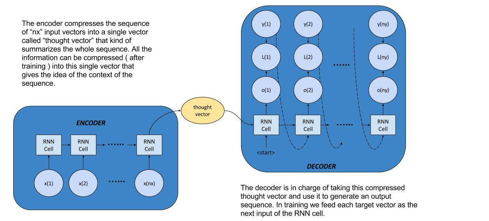
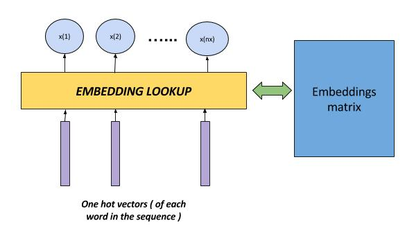
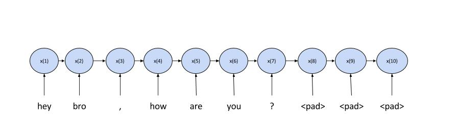
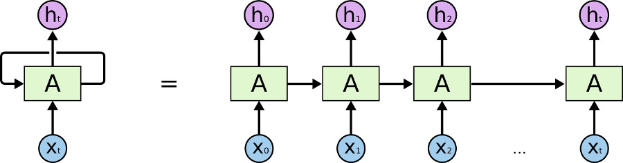
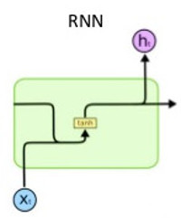

# Making a chatbot using the Seq2Seq model

This is a simple implementation of the [**sequence to sequence model**](https://arxiv.org/abs/1409.3215) to make a chatbot (based on the paper [**"A Neural conversational model"**](https://arxiv.org/abs/1506.05869) by Oriol Vinyals and Quoc Le.

We used tensorflow to implement the model, and based the implementation in the following references :

*   [**DeepQA**](https://github.com/Conchylicultor/DeepQA) repo by Etienne Pot
*   [**Stanford-tensorflow-tutorials**](https://github.com/chiphuyen/stanford-tensorflow-tutorials/tree/master/2017/assignments/chatbot) repo by Chip Huyen

## * About the model

The sequence to sequence model consists of two RNN structures: a Encoder and a Decoder.

Basically, the encoder ( implemented using a sequence to vector RNN ) is in charge of compressing the information of the sequence given into a vector that summarizes all this information. Then this vector is used by the decoder ( implemented using a vector to sequence RNN ) to generate an output sequence.

The use of RNNs for these kind of tasks is described in various sources, an basically we use them because we have to deal with an input that is a sequence of non-defined length. If we used a basic Feed forward net, we should have to specify a fixed size for the input ( maybe a huge vector that would be a concatenation of the sequence, with some kind of padding, which would be very sparse ).

Next, we will analyze each component of the model :

## * Encoder

* Word embeddings :

The inputs to our RNN are a sequence of vectors, which in our case should represent each word of a given sequence of words. This is achieved by using the word-embedding of a certain word, which is a fixed size vector that represents the word in a high dimensional space.

Because the one-hot vectors are used to lookup the word-embedding from the embeddings matrix, we can basically replace the matrix-vector multiplications by a row look-up. So, the inputs to our models are integers that will look-up the embeddings.

* Vocabulary :

As described earlier, the inputs are just look-up unique indices which will look up an embedding related to a word. We have then to basically make a big dictionary of word-LookupIndex mappings that will serve the purpose of transforming a sequence into an array of indices to feed to our encoder. A portion of this mapping is show below.

    * fawn - 38069
    * woods - 2168
    * clotted - 27995
    * \padding\ - 0
    * \unknown\ - 1
    * \start\ - 2
    * \stop\ - 3
    * hanging - 1345
    * woody - 5332
    * tingly - 47470
    * localized - 27996
    * spidery - 27997
    * sevens - 24130
    * disobeying - 24131
    * mutinied - 38070
    * mathison - 31647

Here, each word is given an id, and as you can see there are some  symbols that are given special ids: \padding\, \unknown\, \start\, \stop\, being used to pad a sequence ( complete up to size ), replace in case not found in dictionary, start a sequence for decoder and stop a sequence for the decoder, respectively.

* Input sequence length :

We could keep feeding the encoder data, and it would happily keep encoding this data into the final vector, but the implementation we based on uses a fixed-size sequence length. This serves like the number of iterations in time that our RNN will compute. It also kind of helps when dealing with long sequences, as if some information could be split into two parts that have differente context, then the relationship between these wouldn't be mixed into a one vector, but two.

Of course, there are implementations that use dynamic sequence length, as described [**here**](https://danijar.com/variable-sequence-lengths-in-tensorflow/) and [**here**](https://r2rt.com/recurrent-neural-networks-in-tensorflow-iii-variable-length-sequences.html), or tensorflow's [**dynamic_rnn**](https://www.tensorflow.org/versions/master/api_docs/python/tf/nn/dynamic_rnn)

* Padding :

Some sequences may be shorter than the input-sequence, so we use padding to make this fit into the encoder's input size. Basically, if the sentence "hey bro, how are you?" is split into "[ 'hey', 'bro', ',', 'how', 'are', 'you', '?' ]", and then converted into "[ 10, 25, 75, 454, 123, 657, 1087 ]" we can pad it to a size of 10 by adding the remaining slots as '0' ( or the padding index of the padding symbol in our vocabulary ), which will become "[ 10, 25, 75, 454, 123, 657, 1087, 0, 0, 0 ]"

* RNN cells :

There are some options as to what kind of cell to use in our RNN, which could be a vanilla RNN cell, an LSTM cell and a GRU cell.

Recall, a RNN can be seen in an unrolled way, as show in the following picture :

Each of those rectangles with an 'A' represent an RNN cell ( here, just to be clear, when they mean single cell, they mean this is a full layer of this computing cells  )

The vanilla RNNs have as single computing unit the following RNN cell :

" target="_blank"><img src="https://latex.codecogs.com/gif.latex?h_{t}&space;=&space;tanh(&space;W_{x}&space;x_{t}&space;&plus;&space;W_{h}&space;h_{t-1})" title="h_{t} = tanh( W_{x} x_{t} + W_{h} h_{t-1})")